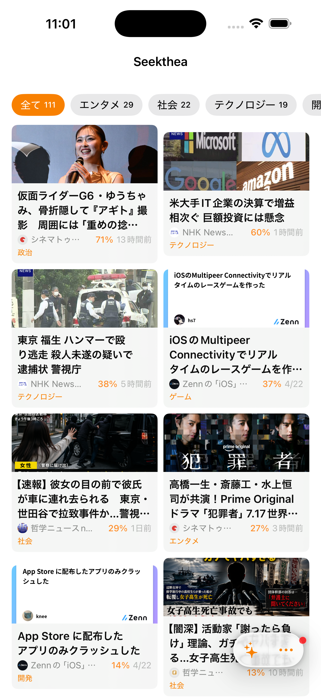
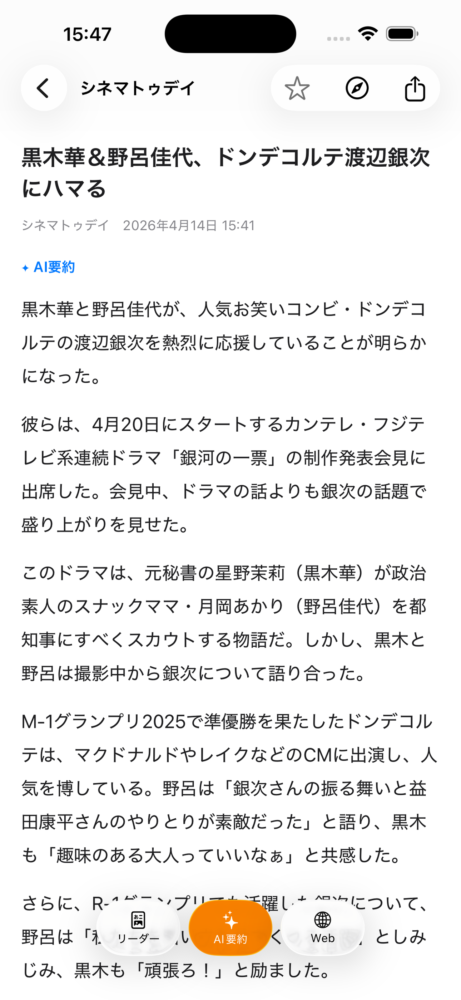
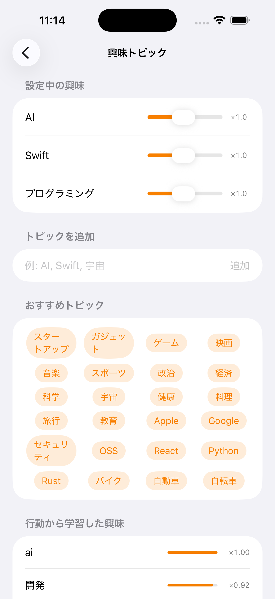

# Apple Intelligenceで動く無料ニュースアプリを作った

## はじめに

Smart NewsやYahoo!ニュースは便利で毎日使っている。でも記事の間に広告が挟まるのがどうしても気になる。ニュースを読みたいだけなのに、広告を避けながらスクロールするのはストレスだ。

「広告なしで、自分が選んだソースから、AIが要約して並べてくれるアプリ」が欲しくて、Seektheaを作りました。

特徴はシンプルで、**広告なし、アカウント登録なし、完全無料**。AI要約もすべてデバイス上で処理されるので、データが外部に送られることもありません。

この記事では、アプリの紹介と、Apple Intelligenceをどう活用しているかを書きます。

## Seektheaとは

**Seekthea**は、ニュースサイト・テック系メディア・ソーシャルメディアなど100以上のRSSソースからトレンドを収集し、Apple Intelligenceで要約・分類するアプリです。

名前はSeek（探す）+ Thea（ギリシャ語で「眺め・視界」）から。ウェブ全体のトレンドを見通して探し出す、という意味を込めています。

### できること

- **AI要約**: 記事をデバイス上で要約。タイムラインを眺めるだけで要点がわかる
- **カテゴリ自動分類**: テクノロジー、ビジネス、エンタメなど、AIが記事を自動でカテゴリに振り分ける
- **パーソナライズ**: 読んだ記事やお気に入りから興味を学習し、「おすすめ」の精度が上がっていく
- **ソース自動発見**: Google Newsのトレンドから新しいソースを見つけて提案
- **iCloud同期**: iPhone / iPad / Mac / Vision Proで既読・お気に入り・ソース設定が同期
- **完全無料**: アカウント登録も広告もなし

### 対応プラットフォーム

iPhone / iPad / Mac / Apple Vision Proのマルチプラットフォーム対応です。SwiftUIで1つのコードベースから全プラットフォームに対応しています。

## なぜApple Intelligenceなのか

AI要約にはChatGPTやClaudeのAPIを使う方法もありますが、従量課金やサーバーの運用コストがかかります。無料アプリでそれは厳しいので、Apple Intelligenceを選びました。結果的にデータがデバイスの外に出ない構成になったので、プライバシー面でも利点になっています。

## AIが記事をどう処理しているか

iOS 26で追加されたApple Intelligenceの機能を使って、2つのAI処理をしています。

### 1. 記事の要約

記事のタイトルと概要をAIに渡して、要点をまとめた短い文章を生成しています。

工夫したのはAIへの指示の出し方です。単に「要約して」と頼むと「この記事は〇〇について紹介しています」のような他人事の文章になりがちです。そこで「ニュース記者として書き直して」と指示することで、「〇〇が発表された」「〇〇が△△に対応」のように、情報が直接伝わる文体になりました。

### 2. カテゴリ分類とキーワード抽出

記事の内容から、最も適切なカテゴリ（テクノロジー、ビジネス、エンタメなど）を自動で判定します。同時に記事の重要キーワードも抽出しています。カテゴリはユーザーが自由に編集できるので、自分好みの分類体系を作れます。

### AI非対応デバイスでも使える

Apple Intelligence非対応のデバイス（iPhone 14以前やIntel Macなど）では、AI要約やカテゴリ分類は無効になりますが、ニュースリーダーとしてそのまま使えます。要約の代わりに記事の説明文をそのまま表示します。

## おすすめの仕組み

Seektheaの「おすすめ」タブでは、記事をあなたへの関連度順に並べています。3つの要素を組み合わせてスコアを計算しています。

**1. キーワードマッチ**

設定した興味トピックや、過去に読んだ記事・お気に入りから学習したキーワードが含まれる記事を優先します。

**2. 意味の近さ**

単純なキーワード一致だけでなく、意味が近い言葉も拾います。たとえば「プログラミング」に興味があれば、「ソフトウェア」「開発ツール」といったキーワードの記事もおすすめに上がります。AIが抽出したキーワードをiOS内蔵の言語処理エンジンで比較することで実現しています。

**3. よく読むカテゴリ**

テクノロジーの記事を多く読む人にはテクノロジーの新着が上位に来る、というように、読書傾向からも学習します。

さらに、新しい記事には少しボーナスをつけて、古い記事ばかりが上位を占めないようにしています。これらの処理はすべてデバイス上で完結しており、閲覧履歴が外部に送信されることはありません。

## まとめ

Seektheaは、Apple Intelligenceを活用して、記事の要約・分類・おすすめをすべてデバイス上で実現したアプリです。

広告なし、アカウント登録なし、完全無料。ニュースを快適に読みたいだけなのに余計なものが多すぎる、と感じている方はぜひ試してみてください。

---

Seekthea - App Store（リンク）
