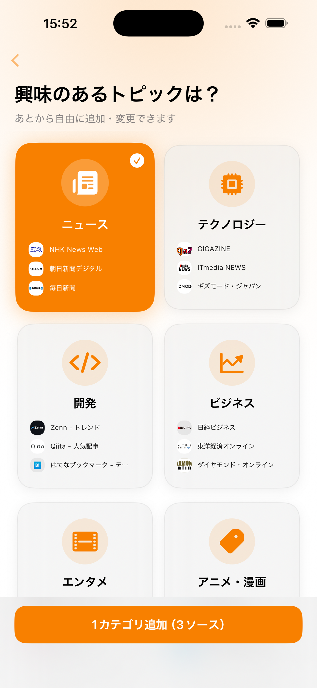
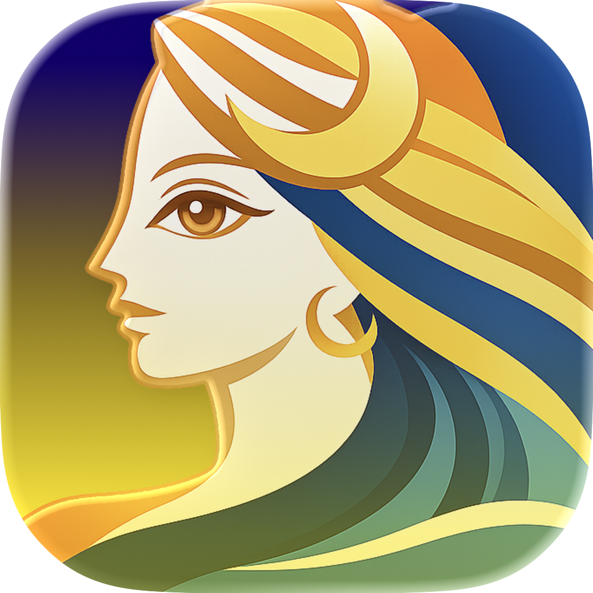

# Apple Intelligenceで動く無料ニュースアプリを作った

## はじめに

Smart NewsやYahoo!ニュースは便利で毎日使っている。でも記事の間に広告が挟まるのがどうしても気になる。ニュースを読みたいだけなのに、広告を避けながらスクロールするのはストレスだ。

「広告なしで、自分が選んだソースから、AIが要約して並べてくれるアプリ」が欲しくて、Seektheaを作った。

特徴はシンプルで、**広告なし、アカウント登録なし、完全無料**。AI要約もすべてデバイス上で処理されるので、データが外部に送られることもない。

[Seekthea - App Store](https://apps.apple.com/app/id6762122200)

## Seektheaとは

**Seekthea**は、ニュース・テック・エンタメなど100以上のソースからトレンドを集めて、Apple IntelligenceのAIで要約・分類するアプリだ。

名前はSeek（探す）+ Thea（ギリシャ語で「眺め・視界」）から。ウェブ全体のトレンドを見通して探し出す、という意味を込めている。

実態はRSSリーダーなのだが、RSSを意識せずに使えるようにしている。

## すぐに始められる

RSSリーダーは最初にフィードURLを登録するのがハードルだが、Seektheaではニュース・テクノロジー・エンタメなど14カテゴリのプリセットから興味のあるものを選ぶだけで始められる。100以上のソースがあらかじめ用意されている。

さらに、Google Newsのトレンドを監視して新しいRSSフィードを自動的に発見・提案する機能もある。自分では見つけられなかったソースが勝手に増えていく。

## 3つの読み方を選べる

記事を開くと、3つのタブで読み方を切り替えられる。

- **リーダー** — 広告やナビゲーションなど余計な要素を除外して、本文だけを表示する。記事の内容に集中できる
- **AI要約** — Apple Intelligenceが記事を要約。長い記事でもすぐに要点を把握できる
- **Web** — 元のサイトをそのまま表示。原文を確認したいときに

AI要約では、単に「要約して」ではなく「ニュース記者として書き直して」と指示している。こうすることで「この記事は〇〇について紹介しています」のような他人事の文章ではなく、「〇〇が発表された」「〇〇が△△に対応」のように情報が直接伝わる文体になる。

面白い副作用として、英語の記事もAIが日本語で要約してくれることがある。海外メディアのRSSを登録しておくと、言語の壁を越えてトレンドを追える。

## 使うほど賢くなる

Seektheaの「おすすめ」モードでは、各記事に0〜100%の興味度スコアが表示される。読んだ記事やお気に入りから興味を自動で学習し、使い続けるほどスコアの精度が上がっていく。

キーワードの一致だけでなく、意味が近い言葉も拾う。たとえば「プログラミング」に興味があれば、「ソフトウェア」「開発ツール」といったキーワードの記事もおすすめに上がる。よく読むカテゴリの記事も優先される。

設定画面では、アプリが学習した自分の興味傾向がTop 20のランキングで確認できる。自分がどんなトピックをよく読んでいるか、意外と自覚がなかったりして面白い。

## どこでも使える

iPhone / iPad / Mac / Apple Vision Proに対応している。既読・お気に入り・ソース設定はiCloudで自動同期されるので、朝iPhoneで読んだ続きをMacで読む、といった使い方ができる。

## なぜ無料でできるのか

AI要約にはChatGPTやClaudeのAPIを使う方法もあるが、従量課金やサーバーの運用コストがかかる。無料アプリでそれは厳しい。

Seektheaが使っているのはiOS 26で追加されたApple Intelligenceだ。デバイスに内蔵されたAIなので、追加コストなしで要約やカテゴリ分類ができる。結果的にデータがデバイスの外に出ない構成になったので、プライバシー面でも利点になっている。

ただし、Apple Intelligence対応デバイス（iPhone 15 Pro以降など）が必要だ。非対応デバイスではAI要約やカテゴリ分類は無効になるが、ニュースリーダーとしてそのまま使える。

## まとめ

Seektheaは、Apple Intelligenceを活用して、記事の要約・分類・おすすめをすべてデバイス上で実現したアプリだ。

広告なし、アカウント登録なし、完全無料。ニュースを快適に読みたいだけなのに余計なものが多すぎる、と感じている方はぜひ試してみてほしい。

---

[Seekthea - App Store](https://apps.apple.com/app/id6762122200)
